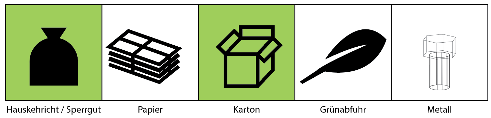

# 2019 Diplomarbeit Entsorgungskalenderanzeige Backend
[
](https://sonarcloud.io/dashboard?id=Entsorgungskalenderanzeige_Backend) 
[](https://app.codacy.com/app/christianpetri/2019_Diplomarbeit_Entsorgungskalenderanzeige_Webseite?utm_source=github.com&utm_medium=referral&utm_content=christianpetri/2019_Diplomarbeit_Entsorgungskalenderanzeige_Webseite&utm_campaign=Badge_Grade_Dashboard)
[](https://codeclimate.com/github/christianpetri/2019_Diplomarbeit_Entsorgungskalenderanzeige_Webseite/maintainability)

## Programmschnittstelle (API) für das Frontend
### /plain/
Die Schnittstelle hat ihren Namen aus dem englischen "content-type: text/plain" auf Deutsch "Inhaltstyp: Klartext" erhalten.  
Er bietet dem Frontend die Möglichkeit den aktuellen Status, ob die Entsorgungsgüter an die Strasse gestellt werden dürfen, abzurufen.  

In der folgenden Tabelle sind die verfügbaren Optionen der API dargestellt:

|URL         |Methode|Parameter|Inhaltstyp|Beschreibung                |Beispiel Resultat|
|------------|-------|---------|----------|----------------------------|-----------------|
|/plain/     |GET	 |circleId |text/plain|Ist Abfuhr, wenn ja, welche?|100100           |
|/plain/test/|GET    |circleId |text/plain|Ist die Kreis-ID korrekt?   |1                |

In der Gemeinde Rapperswil-Jona liegen folgenden Kreise vor (Stand 2019):  
Jeder Kreis der Gemeinde hat eine ID und einen Kreisbeschreibung:  

|Kreis ID|Kreisbeschreibung|
|--------|-----------------|
|1       |1                |
|2       |1a               |
|3       |1b               |
|4       |2                |
|5       |3                |
|6       |4                |
|7       |5                |
|8       |6                |
|9       |7                |
|10      |8                |
|11      |9                |

#### Verwendung von /plain
Bitte geben Sie die korrekte Kreis-ID (circleId) für Ihren Kreis an. (Unten als Beispiel: 6)  
URL: `plain/?circleId=6`  
Anforderungs-URL: [https://www.entsorgungskalenderanzeige.christianpetri.ch/plain/?circleId=6](https://www.entsorgungskalenderanzeige.christianpetri.ch/plain/?circleId=6)  
Anforderungsmethode: GET  

Beispiel Antwort: **100100**  
Content-Type: text/plain;charset=UTF-8

Hinweis: Am Anfang der Sequenz steht immer eine 1 (oder eine 2) (1 = Kalender erfolgreich geprüft, 2 = Fehler beim Aufrufen des Kalenders).
Die folgenden 0 und 1 sind "booleans", um anzuzeigen, ob der Abfall nach draussen gebracht werden kann.  

1 = wahr, 0 = falsch // 1 = LED ist EIN, 0 = LED ist AUS

Die Anwort **101100** bedeutet folgendes:  
`[1] [0] [1] [1] [0] [0]`  
`[1] ["Grüngut"] ["Karton"] ["Kehricht und Sperrgut"] ["Metall"] ["Papier"]`  

Die erste Zahl steht für nichts, es ist ein Platzhalter, um die Sequenz zu starten  
Die zweite Zahl steht für Grüngut.  
Die dritte Zahl steht für Karton.  
Die vierte Zahl steht für Kehricht und Sperrgut.  
Die fünfte Zahl steht für Metall.  
Die sechste Zahl steht für Papier.  
 

istHeuteGrünAbfuhr = 0 = falsch -> Licht ist aus  
istHeuteKartonAbfuhr = 1 = wahr -> Licht ist an  
istHeuteKehrichtUndSperrgutAbfuhr = 1 = wahr -> Licht ist an  
istHeuteMetallAbfuhr = 0 = falsch -> Licht ist aus  
istHeutePapierAbfuhr = 0 = falsch -> Licht ist aus  

Diese Informationen auf der Anzeige dargestelle, könnte folgendermassen Aussehen:


#### Verwendung von /plain/test
Wenn Sie prüfen möchten, ob die Kreis-ID (im Backend) tatsächlich existiert, geben Sie eine Kreis-ID über einen GET-Request an.

URL: `plain/test/?circleId=6`  
Anforderungs-URL: [https://www.entsorgungskalenderanzeige.christianpetri.ch/plain/test/?circleId=6](https://www.entsorgungskalenderanzeige.christianpetri.ch/plain/test/?circleId=6)  
Anforderungsmethode: GET  

Erwartetes Ergebnis bei Erfolg (Kreis-ID ist korrekt konfiguriert): 1  
Erwartetes Ergebnis bei Misserfolg (Kreis-ID ist nicht korrekt oder sie wurde noch nicht angegeben): 0
## Testseite
Unter `/test` z.B. [https://www.entsorgungskalenderanzeige.christianpetri.ch/test/](https://www.entsorgungskalenderanzeige.christianpetri.ch/test/) können Sie testen, ob die Webseite ordnungsgemäss funktioniert.

## Aufsetzen der Webseite
Voraussetzung: Server der mit PHP umgehen kann.
Eine Datenbank die SQL verarbeiten kann.

1.  Datenbank aussetzten
2.  Die Scripts, die im Ordner SQL liegen, in der Datenbank laufen lassen:
a.  create_tables.sql 
b.  insert_data_into_tables_*year*.sql
3.  Die Datei von www/entsorgungskalenderanzeige/connect.sample.php in www/entsorgungskalenderanzeige/connect.php umbennen.
4. 	Die Datei www/entsorgungskalenderanzeige/connect.php öffnen und die Zugangsdaten der Datenbank eingeben.
5. 	Die Dateien und Ordner aus dem Order www/entsorgungskalenderanzeige/ in den publiken Ordner des Servers ziehen.
6. 	Die Seite yourdomain.com/test aufrufen. Wenn alles funktioniert hat, sollte dies hier ersichtlich sein.


## Sonar
   Dieses Projekt verwendet die SonarCloud, um den Code zu überprüfen. Bitte besuchen Sie den Link unten, um die Analyse zu sehen<br/>
     [Sonar Entsorgungskalenderanzeige Backend](https://sonarcloud.io/dashboard?id=Entsorgungskalenderanzeige_Backend)  <br/>
     
1. Installieren Sie den Sonar-Client
  [How to install SonarQube Scanner](https://docs.sonarqube.org/display/SCAN/Analyzing+with+SonarQube+Scanner)
2. Um den Code zur Analyse in die Sonar-Cloud zu verschieben, verwenden Sie bitte den folgenden Befehl  

```console 
sonar-scanner
```
